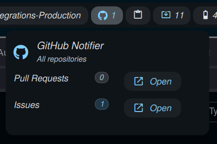

# GitHub Notifier plugin for DankMaterialShell

Shows a compact badge in the DankBar with counts for open Pull Requests authored by you and Issues assigned to you, using the `gh` CLI. Includes a popup with a breakdown and quick links to GitHub filtered for the current user.



## Features

- Badge in the bar showing the total count (PRs + issues)
- Popup with separate counts and "open in browser" links
- Optional filter by GitHub organization
- Configurable refresh interval and what to count (PRs/issues)

## Installation

```bash
mkdir -p ~/.config/DankMaterialShell/plugins/
git clone <this-repo-url> githubNotifier
```

Then enable the plugin via DMS Settings → Plugins and add the `githubNotifier` widget to your DankBar.

## Usage

1. Open DMS Settings (Super + ,)
2. Enable the `GitHub Notifier` plugin
3. Optionally set an `Organization` to filter results to a specific org
4. Configure `gh binary` if not simply `gh`
5. The widget will query `gh` periodically (configurable) and update counts

## Settings

- `Organization`: optional. Filters PRs and issues to the specified GitHub organization.
- `ghBinary`: binary name/path (default: `gh`).
- `refreshInterval`: seconds between automatic refreshes.
- `Count Pull Requests`: toggle to include/exclude open PRs authored by you.
- `Count Issues`: toggle to include/exclude open issues assigned to you.

## Files

- `plugin.json` — plugin manifest
- `GitHubNotifierWidget.qml` — main widget and popup implementation
- `GitHubNotifierSettings.qml` — settings UI
- `README.md` — this file

## Permissions

This plugin requests:

- `process` — to run the `gh` CLI
- `settings_read` / `settings_write` — to read and persist plugin settings

## Requirements

- `gh` CLI installed, authenticated, and available in PATH or referenced via `ghBinary` setting.
- `Font Awesome` (e.g. Font Awesome 6 Brands) — required so the GitHub icon displays correctly.

## How it works

The plugin executes `gh` commands to obtain counts:

- Check `gh` binary: `gh --version`
- Check authentication: `gh auth status`
- PRs count: `gh search prs --author=@me --state=open [--owner=<org>] --json number`
- Issues count: `gh search issues --assignee=@me --state=open [--owner=<org>] --json number`

The widget parses JSON output (supports `total_count`, arrays, and NDJSON).

## Troubleshooting

- If counts are zero but the CLI shows results, check `ghBinary` setting and ensure `gh` works in a terminal: `gh search prs --author=@me --state=open --json number`
- If `gh` is not authenticated, run: `gh auth login`
